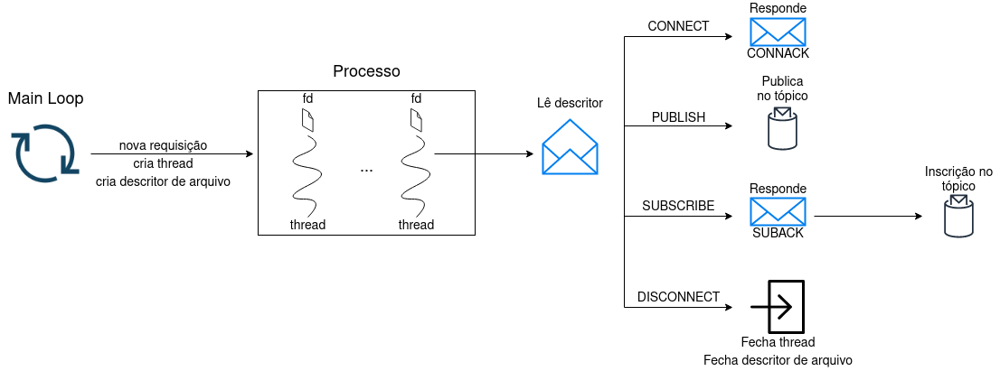

## EP1 - MAC0352

## Autor: Ygor Tavela Alves

# Arquitetura

# Arquivos
Na raiz deste projeto encontram-se um Makefile para compilar o programa, um bash script para executar testes de perfomance de cpu/memória, um arquivo slides.pdf contendo uma breve apresentação do EP1, um diretório tests/ contendo as gráficos de performance dos testes realizados e, por fim, o diretório src/ que contém o código fonte do projeto.
O diretório src/ se organiza da seguinte maneira:
- header e implementação do servidor MQTT (server.h e server.c)
- header e implementação de funções utilitárias (utils.h e utils.c)
- header e implementação de funções relacionadas ao desempacotamento de pacotes de rede (deserialize_packet.h e deserialize_packet.c)
- header e implementação de funções relacionadas ao empacotamento de pacotes de rede (serialize_packet.h e serialize_packet.c)
- header de algumas constantes relacionadas ao protocolo MQTT (mqtt.h)
- header de macros que implementam estruturas de dados usadas para implementar o EP, no caso, Hash Table (uthash.h) e Double Linked List (utlist.h)
  - créditos: https://github.com/troydhanson/uthash

# Compilando o programa
O programa pode ser compilado através do programa make, utilizando o Makefile presente na pasta raiz do EP. Há duas opções para executar o make:
  - make: compilação padrão do programa gerando executável server no diretório;
  - make clean: apaga programa

# Executando o programa
O programa pode ser executado após compilação utilazando o make. Para isto, basta executar o comando:
./server #porta_de_rede
  - #porta_de_rede: porta em que o servidor irá ficar escutando as requisições.

# Sobre o bash script de teste
O bash script tem por função testar apenas a CPU e Memória utilizada pelo servidor MQTT para uma dada quantidade de clientes. Para uma entrada de clientes X, o programa irá iniciar X subscribers e por um intervalo de 60s, a cada 5s, X publishers irá publicar uma mensagem no tópico correspondente.
Para realizar análise de consumo de rede pode ser utilizado a própria interface do Wireshark (Statistics -> I/O Graphs) enquanto o bash script é executado.
Para executar o bash script, basta executar:
./run_tests.sh #IP_HOST #PORTA_HOST #QUANTIDADE_CLIENTES
  - #IP_HOST: ip da máquina que está executando o servidor
  - #PORTA_HOST: porta que o servidor está escutando
  - #QUANTIDADE_CLIENTES: quantidade de publishers/subscribers simultâneos
Por exemplo,
./run_tests.sh localhost 1883 50
irá executar um teste em que será iniciado 50 subscribers, e durante um intervalo de 60 segundos, a cada 5s, 50 publishers irá publicar no tópico correspondente.

# Dependências
bash script p/ execução de testes:
- psrecord: Geração de gráfico de perfomance cpu/memória, para instalar: $ pip3 install psrecord
